# png2c64

[](LICENSE)
[](https://png2c64.app)
[](https://en.cppreference.com/w/cpp/26)

Convert images to Commodore 64 VIC-II formats with perceptual color matching, dithering, and brute-force quantization.

**[Try it in your browser at png2c64.app](https://png2c64.app)** — no installation required, runs entirely client-side via WebAssembly.

Built for C64 demo scene production. All color operations use [OKLab](https://bottosson.github.io/posts/oklab/) perceptual color space. Multithreaded native CLI + WASM web app.

## Why png2c64?

| Feature | png2c64 | Typical converters |
|---|---|---|
| Color matching | OKLab perceptual space | RGB euclidean |
| Dither-aware quantization | Yes — picks colors that dither well together | No — picks nearest colors, then dithers |
| Dithering modes | 17 (ordered, error diffusion, line-based, 2:1-aware) | 1-3 |
| Preprocessing | OKLab contrast/saturation/hue, sharpen, levels | Basic RGB |
| Interactive tuning | CLI + web with live preview | Batch only |
| Palette range matching | Automatic OKLab extent mapping | Manual |
| CRT simulation | PAL bandwidth, scanlines, phosphor bloom | None |
| Export formats | PNG, PRG (with displayer), Koala, Art Studio, C headers, PETSCII text | 1-2 formats |
| Runs in browser | Yes (WASM) | No |

## Examples

| | | |
|---|---|---|
| 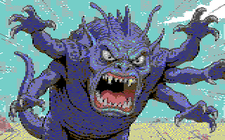 | 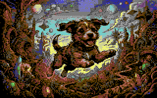 | 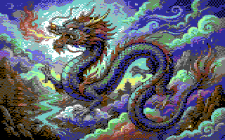 |
| 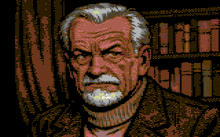 | 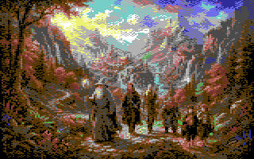 | 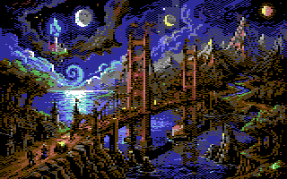 |
| 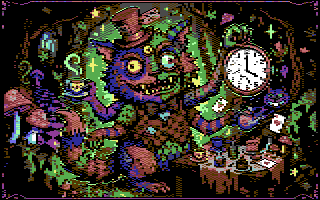 | 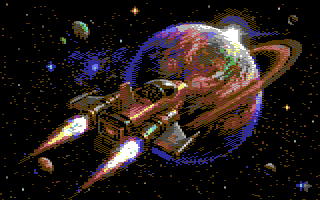 | 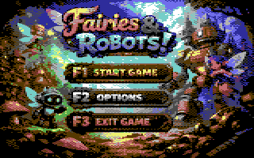 |

### PETSCII

| | |
|---|---|
| 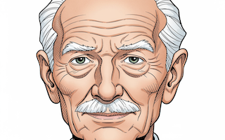 | 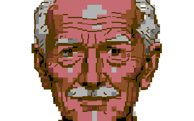 |
| Input | PETSCII (40x25 text mode) |

## Dither Modes

All 17 modes shown with `--gamma 1 --dither-strength 0.7 --error-clamp 0.2`. Click to expand:

<details open><summary><b>none</b> — no dithering</summary>
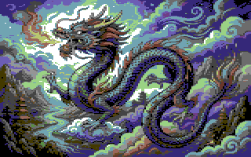
</details>

<details><summary><b>bayer4</b> — 4x4 ordered</summary>
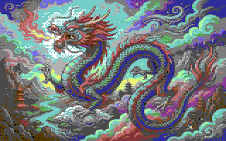
</details>

<details><summary><b>bayer8</b> — 8x8 ordered</summary>
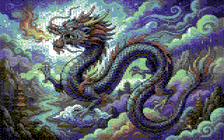
</details>

<details><summary><b>checker</b> — 2:1 checkerboard</summary>

</details>

<details><summary><b>bayer2x2</b> — 2:1 minimal ordered</summary>

</details>

<details><summary><b>h2x4</b> — 2:1 horizontal-biased</summary>
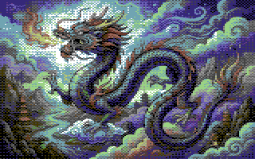
</details>

<details><summary><b>clustered</b> — 2:1 clustered dot</summary>
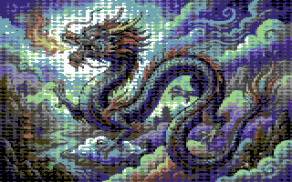
</details>

<details><summary><b>line2</b> — horizontal 2-level</summary>
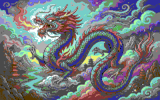
</details>

<details><summary><b>line-checker</b> — line-biased checker</summary>

</details>

<details><summary><b>line4</b> — horizontal 4-level</summary>
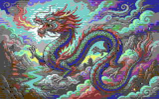
</details>

<details><summary><b>line8</b> — horizontal 8-level</summary>
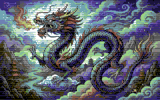
</details>

<details><summary><b>fs</b> — Floyd-Steinberg</summary>

</details>

<details><summary><b>atkinson</b> — Atkinson (75% error)</summary>
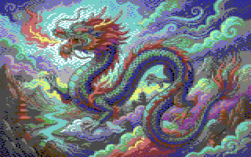
</details>

<details><summary><b>sierra</b> — Sierra Lite</summary>
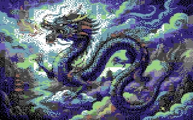
</details>

<details><summary><b>fs-wide</b> — 2:1 Floyd-Steinberg</summary>
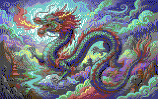
</details>

<details><summary><b>jarvis</b> — Jarvis-Judice-Ninke</summary>

</details>

<details><summary><b>line-fs</b> — vertical error diffusion</summary>

</details>

## Features

- **Bitmap modes** -- hires (320x200, 2 colors/cell) and multicolor (160x200, 4 colors/cell)
- **FLI modes** -- FLI multicolor and AFLI hires with per-row color attributes, PRG export with displayer
- **PETSCII mode** -- image approximation using the C64's built-in 256-character ROM, brute-force best character + color per cell
- **Sprite sheets** -- hires and multicolor, arbitrary grid dimensions
- **Character sets** -- 256-char charset generation with dedup, pattern merging, k-means refinement, and C header export
- **7 VIC-II palettes** -- Pepto, VICE, Colodore, Deekay, Godot, C64 Wiki, Levy
- **17 dither modes** -- ordered (Bayer, checker, clustered dot, horizontal lines) and error diffusion (Floyd-Steinberg, Atkinson, Jarvis), including 2:1 pixel-ratio and line-biased variants
- **Perceptual preprocessing** -- OKLab-space contrast/saturation/brightness/gamma, plus automatic palette range matching
- **Interactive mode** -- live parameter tuning in the terminal with instant preview (iTerm2)
- **Gallery mode** -- preview all dither methods or parameter sweeps inline in the terminal (iTerm2)
- **C header export** -- charset data, screen map, and color RAM as includable arrays

## Requirements

- GCC 15+ (uses C++26 / `-std=c++2c`)
- CMake 3.28+
- macOS or Linux

## Build

```bash
cmake -B build -DCMAKE_C_COMPILER=gcc-15 -DCMAKE_CXX_COMPILER=g++-15 .
cmake --build build
```

Run tests:
```bash
ctest --test-dir build --output-on-failure
```

## Usage

### Multicolor bitmap (default)
```bash
png2c64 input.jpg output.png
png2c64 --gamma 2.0 --dither jarvis input.jpg output.png
```

### Hires bitmap
```bash
png2c64 --mode hires input.jpg output.png
```

### Sprite sheet
```bash
# 6x2 multicolor sprite sheet
png2c64 --mode sprite-mc --sprites-x 6 --sprites-y 2 input.png output.png

# Single hires sprite
png2c64 --mode sprite-hi input.png output.png
```

### FLI / AFLI
```bash
png2c64 --mode fli input.jpg output.png    # multicolor FLI, per-row colors
png2c64 --mode afli input.jpg output.png   # hires FLI, per-row colors
```

### PETSCII
```bash
# Uses C64 ROM charset to approximate the image in text mode
png2c64 --mode petscii --gamma 3.3 --dither-strength 0.7 input.jpg output.png
```

### Character set
```bash
# Multicolor charset from full-screen image -> C header
png2c64 --mode charset-mc --width 320 --height 200 --dither checker input.jpg output.h

# Hires charset, no dithering (full k-means optimization)
png2c64 --mode charset-hi --width 320 --height 200 --dither none input.jpg output.h
```

The charset output is a C header file containing:
```c
#define name_COLS 40
#define name_ROWS 25
#define name_BACKGROUND 0
#define name_MULTICOLOR1 6
#define name_MULTICOLOR2 14

static const unsigned char name_charset[2048] = { ... };
static const unsigned char name_screen[1000] = { ... };
static const unsigned char name_color[1000] = { ... };
```

### Interactive mode
Live parameter tuning with instant preview in iTerm2:
```bash
png2c64 --interactive input.jpg output.png
png2c64 --mode charset-mc --width 320 --height 200 --interactive input.jpg output.h
```

| Key | Action | Key | Action |
|-----|--------|-----|--------|
| `p`/`P` | palette next/prev | `d`/`D` | dither next/prev |
| `g`/`G` | gamma +/- | `s`/`S` | strength +/- |
| `b`/`B` | brightness +/- | `c`/`C` | contrast +/- |
| `t`/`T` | saturation +/- | `e`/`E` | error clamp +/- |
| `x` | serpentine toggle | `r` | reset all |
| `w` | save output | `q` | quit |

### Gallery mode
Preview parameter variations inline in iTerm2:
```bash
png2c64 --gallery dither input.jpg
png2c64 --gallery gamma input.jpg

# Available: dither, brightness, contrast, saturation, gamma,
#            error-clamp, dither-strength
```

Gallery and interactive work with all modes including charset.

## Options

```
--mode <mode>              hires, multicolor, fli, afli, petscii,
                           sprite-hi, sprite-mc, charset-hi, charset-mc
                           (default: multicolor)
--palette <name>           pepto, vice, colodore, deekay, godot,
                           c64wiki, levy  (default: colodore)
--dither <method>          Dithering method (default: checker)
  Square-pixel:            none, bayer4, bayer8, fs, atkinson, sierra
  2:1 multicolor:          checker, bayer2x2, h2x4, clustered, fs-wide, jarvis
  Horizontal lines:        line2, line-checker, line4, line8, line-fs
--dither-strength <float>  0.0-2.0 (default: 0.7)
--error-clamp <float>      Max error accumulation 0.1-2.0 (default: 0.8)
--no-serpentine            Disable bidirectional scanning
--brightness <float>       -1.0 to 1.0 (default: 0.0)
--contrast <float>         0.0 to 2.0 (default: 1.0)
--saturation <float>       0.0 to 2.0 (default: 1.0)
--gamma <float>            0.1 to 8.0 (default: 1.5)
--match-range              Enable palette range matching (default: off)
--width <int>              Override target width
--height <int>             Override target height
--sprites-x <int>          Sprite sheet columns (default: 1)
--sprites-y <int>          Sprite sheet rows (default: 1)
--gallery <param>          Preview parameter variations in terminal
--interactive              Live parameter tuning with instant preview
```

## How it works

### Pipeline

```
Load image (PNG/JPEG/BMP/TGA via stb_image)
  -> Bicubic scale (separable Mitchell-Netravali)
  -> Preprocess (gamma, brightness, contrast, saturation)
  -> Match palette range (remap OKLab extent to target palette)
  -> Brute-force quantize (per-cell, all valid color combinations)
  -> Dither (error diffusion in OKLab space)
  -> Output (PNG + iTerm2 inline preview)
```

### Quantization

Each cell is quantized by exhaustively testing all valid color combinations:

| Mode | Combinations per cell | Total for screen |
|------|----------------------|-----------------|
| Hires | C(16,2) = 120 pairs | ~15M evaluations |
| Multicolor | 16 backgrounds x C(15,3) = 455 triples | ~931M evaluations |
| FLI | 16 bg x 15 colorram x C(14,2) x 8 rows | ~44K/cell |
| PETSCII | 16 bg x 256 chars x 15 fg | ~61M evaluations |
| Charset MC | C(16,3) = 560 shared triples x 13 per-cell | ~300M evaluations |

All distance computations use squared OKLab perceptual distance. Cell processing is parallelized across all CPU cores via `std::jthread`.

### Charset mode

1. **Color selection** -- brute-force optimal shared colors
2. **Dithering** -- error diffusion within cell color constraints
3. **Pattern encoding** -- 8-byte binary patterns from dithered assignments
4. **Deduplication** -- identical patterns share charset entries
5. **Merging** -- if > 256 unique: precompute pairwise OKLab distances, sort, merge closest pairs
6. **K-means refinement** -- iteratively reassign cells to best-matching patterns. With dithering: preserves dither patterns (assignments only). Without: full centroid recomputation.

### Dithering

Error diffusion operates entirely in OKLab space -- the error buffer, accumulation, and distribution all use OKLab values. This prevents the visible cell-boundary artifacts that occur when mixing RGB error propagation with OKLab color matching.

The 2:1 dither modes account for the double-wide multicolor pixel:
- **h2x4** -- 2x4 Bayer matrix that tiles as a perceptually square block at 2:1 display
- **clustered** -- dot pattern shaped for round appearance at 2:1
- **fs-wide** -- Floyd-Steinberg with vertical-biased weights
- **jarvis** -- Jarvis-Judice-Ninke 5x3 kernel, naturally handles 2:1 via wider reach

## Project structure

```
src/
  main.cpp           CLI, pipeline, iTerm2 display, gallery
  types.hpp          Color3f, Image, Palette, Result<T>
  color_space.hpp    sRGB/linear/OKLab (constexpr)
  vic2.hpp           VIC-II modes and constraints
  palette.hpp        7 palettes (constexpr, registry)
  png_io.hpp/.cpp    Load/save/encode via stb_image
  scale.hpp/.cpp     Bicubic scaling
  preprocess.hpp/.cpp  Color adjustments + OKLab range matching
  quantize.hpp/.cpp  Brute-force quantization (multithreaded)
  dither.hpp/.cpp    17 dither algorithms (OKLab)
  charset.hpp/.cpp   Charset conversion + C header export
  petscii_rom.hpp    C64 character ROM (256 chars, precomputed bit tables)
  prg.hpp/.cpp       PRG export with embedded displayers
  displayer_data.hpp Koala/hires/FLI/AFLI/PETSCII displayer binaries
third_party/
  stb_image.h, stb_image_write.h
```

## License

MIT
